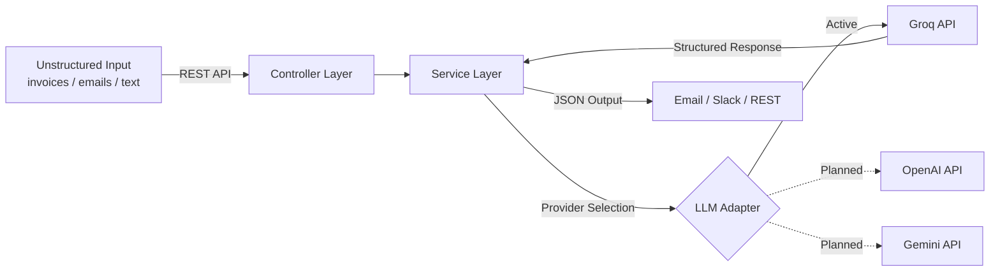

# AI Logistics Automation Hub


> **Intelligent Document-to-JSON Extractor** | Java 17 · Spring Boot 3 · Layered Architecture · Groq AI

A professional-grade backend service that converts unstructured documents (invoices, emails, reports) into structured JSON using LLM APIs. Built for operations teams that need reliable, auditable data extraction without vendor lock-in.

---

### ⚡ Quick Showcase: From Text to JSON

**Input (Raw Email/Invoice Text):**
```text
Subject: Invoice from ACME Corp
Date: Jan 20, 2026
Total: $2,450.50
Notes: Please process by EOD.
```

**Output (Structured JSON):**
```json
{
  "companyName": "ACME Corp",
  "date": "2026-01-20",
  "totalAmount": 2450.5
}
```

---

## 🏗️ How It Works



1. **Input** — Raw text is sent to the REST endpoint.
2. **Service Layer** — Applies extraction rules and coordinates with the selected AI provider.
3. **LLM Adapter** — Sends a structured prompt to Groq (with planned support for OpenAI and Gemini) and receives pure JSON.
4. **Output** — Validated JSON is persisted in H2, dispatched to Email/Slack, or returned via REST.

---

## Features

- **AI-Powered Data Extraction** — Uses Groq AI to intelligently parse and structure raw text (Company, Date, Amount). Support for OpenAI and Gemini is planned.
- **Email Integration** — Automatically sends formatted extraction results via SMTP.
- **Slack Integration** — Posts extracted results to a configured Slack channel via Webhook.
- **RESTful API** — Clean endpoints for extraction, notification dispatch, and demo resets.
- **Interactive API Docs** — Swagger UI available at `/swagger-ui/index.html` for live testing.
- **Containerized** — Includes a `Dockerfile` for easy deployment and scaling.

---

## Project Context & Architecture

This project showcases a professional approach to **AI integration** and **Clean Coding**. It follows a **Layered Architecture** — the standard for Spring Boot applications — ensuring clear separation of concerns:

| Layer | Responsibility |
|---|---|
| **Controllers** | Handle HTTP requests and delegate to services |
| **Services** | Core business logic and AI extraction orchestration |
| **Repositories** | Abstract data access via Spring Data JPA |
| **DTOs / Models** | Typed data structures for clean API contracts |

### Architectural Principles
While pragmatic, the project respects core **Clean Architecture** principles:
- **Separation of Concerns**: Each layer has a single, well-defined responsibility.
- **One-Way Dependency**: Flow is strictly `Controllers` → `Services` → `Repositories`.
- **Statelessness**: The service layer remains stateless to support easy scaling.

---

## 🚀 Showcase Scenarios

Explore real-world logistics automation stories (Delayed Shipment Alerts, Invoice Routing, and Operations Digests) in our [Showcase Guide (docs/demo-guide.md)](docs/demo-guide.md).

---

## 📚 Documentation

Detailed documentation and guides are available in the [docs/](docs/) folder:
- [Roadmap](docs/roadmap.md) — Project phases and progress.
- [AI Integration Guide](docs/ai-integration.md) — Technical details on LLM usage.
- [Troubleshooting](docs/troubleshooting.md) — Common issues and fixes.
- [Review Notes](docs/review-notes.md) — Architectural best practices and QC.

---

## API Documentation

Explore and test endpoints via **Swagger UI**:
- [http://localhost:8080/swagger-ui/index.html](http://localhost:8080/swagger-ui/index.html)

---

## Getting Started

### 1. Clone & Configure
```bash
git clone https://github.com/HectorCorbellini/ai-logistics-automation-hub.git
cd ai-logistics-automation-hub
```

Copy `.env.example` to `.env` and fill in your credentials:
- `GROQ_API_KEY`: Your Groq API key.
- `EMAIL_USERNAME` / `EMAIL_PASSWORD`: SMTP credentials.
- `SLACK_WEBHOOK_URL`: Slack Incoming Webhook URL.

### 2. Build and Run
**Option A — Maven:**
```bash
mvn spring-boot:run
```

**Option B — Docker:**
```bash
mvn clean package -DskipTests
docker build -t ai-logistics-hub:latest .
docker run -d -p 8080:8080 --name ai-logistics-hub ai-logistics-hub:latest
```

The application will be available at `http://localhost:8080`.

---

*This project follows the [Hector Corbellini Engineering Standards](https://github.com/HectorCorbellini/hector-repo-standard).*
