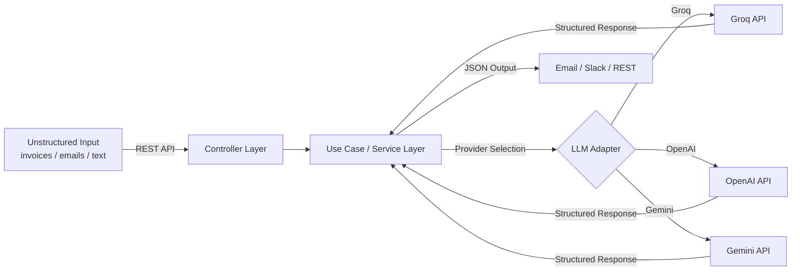

# AI Logistics Automation Hub


> **Intelligent Document-to-JSON Extractor** | Java 17 · Spring Boot 3 · Layered Architecture · Groq / OpenAI / Gemini

A production-ready backend service that converts unstructured documents (invoices, emails, reports) into structured JSON using LLM APIs.
Built for operations teams that need reliable, auditable data extraction without vendor lock-in.

---

### ⚡ Quick Showcase: From Text to JSON

**Input (Raw Email/Logistics Text):**
```text
Subject: NEW LOAD - SHIPMENT #45621
Pickup: 123 Industrial Way, New Jersey
Delivery: 99 Port Rd, Miami
Total: $4,500.00
Carrier: Express Logix
```

**Output (Structured JSON):**
```json
{
  "shipment_id": "45621",
  "pickup": "123 Industrial Way, New Jersey",
  "delivery": "99 Port Rd, Miami",
  "amount": 4500.0,
  "currency": "USD",
  "carrier": "Express Logix"
}
```

---

## 🏗️ How It Works



1. **Input** — Raw text is sent to the REST endpoint.
2. **Service Layer** — Applies extraction rules and selects the configured LLM provider.
3. **LLM Adapter** — Sends a structured prompt to Groq, OpenAI, or Gemini.
4. **Output** — Validated JSON is dispatched to Email and/or Slack, or returned directly via REST.

---

## Features

- **AI-Powered Data Extraction** — Uses Groq AI (with OpenAI and Gemini support) to extract structured data from unstructured text.
- **Email Integration** — Sends extracted results to any email address via SMTP.
- **Slack Integration** — Posts extracted results to a configured Slack channel via Webhook.
- **RESTful API** — Clean endpoints for both direct extraction and notification dispatch.
- **Interactive API Docs** — Swagger UI available at `/swagger-ui.html` for live endpoint testing.
- **Containerized** — Includes a `Dockerfile` for easy deployment and scaling.
- **Production Security** — All credentials managed via environment variables; no secrets in code.

---

## Architecture

This project follows a **Layered Architecture** — the standard for Spring Boot applications — with clear separation of concerns:

| Layer | Responsibility |
|---|---|
| **Controllers** | Handle HTTP requests and delegate to services |
| **Services** | Core business logic and AI extraction orchestration |
| **Repositories** | Abstract data access via Spring Data JPA |
| **DTOs / Models** | Typed data structures for clean API contracts |

Dependency flow is strictly one-directional: `Controllers` → `Services` → `Repositories`.

---

## Prerequisites

- Java 17
- Maven 3.8+
- Docker (optional, for containerized deployment)
- A valid Groq API key (OpenAI or Gemini also supported)

---

## Getting Started

### 1. Clone the Repository

```bash
git clone https://github.com/HectorCorbellini/ai-logistics-automation-hub.git
cd ai-logistics-automation-hub
```

### 2. Configure Environment Variables

The application reads all sensitive credentials from environment variables:

| Variable | Description |
|---|---|
| `GROQ_API_KEY` | Your Groq API key |
| `EMAIL_USERNAME` | SMTP email username |
| `EMAIL_PASSWORD` | SMTP email password or App Password |
| `SLACK_WEBHOOK_URL` | Slack Incoming Webhook URL |

### 3. Build and Run

**Option A — Maven:**
```bash
mvn spring-boot:run
```

**Option B — Docker:**
```bash
mvn clean package -DskipTests
docker build -t ai-logistics-hub:latest .
docker run -d -p 8080:8080 --name ai-logistics-hub ai-logistics-hub:latest
```

The application will be available at `http://localhost:8080`.

---

## API Documentation

Interactive documentation is available via Swagger UI — explore and test all endpoints directly from your browser:

- **Swagger UI**: [http://localhost:8080/swagger-ui.html](http://localhost:8080/swagger-ui.html)
- **OpenAPI JSON**: [http://localhost:8080/v3/api-docs](http://localhost:8080/v3/api-docs)

---

## Running Tests

```bash
mvn test
```

---

## 📧 Contact & Collaboration

**Looking for professional AI implementation?**

This project is developed by **Héctor Corbellini** — Java backend developer specialising in AI integration and secure software development, based in **Uruguay (EST/EDT timezone)** for seamless collaboration with North American partners.

[LinkedIn](https://www.linkedin.com/in/hector-corbellini/) · [GitHub Portfolio](https://github.com/HectorCorbellini)

---

*This project follows the [Hector Corbellini Engineering Standards](https://github.com/HectorCorbellini/hector-repo-standard).*
